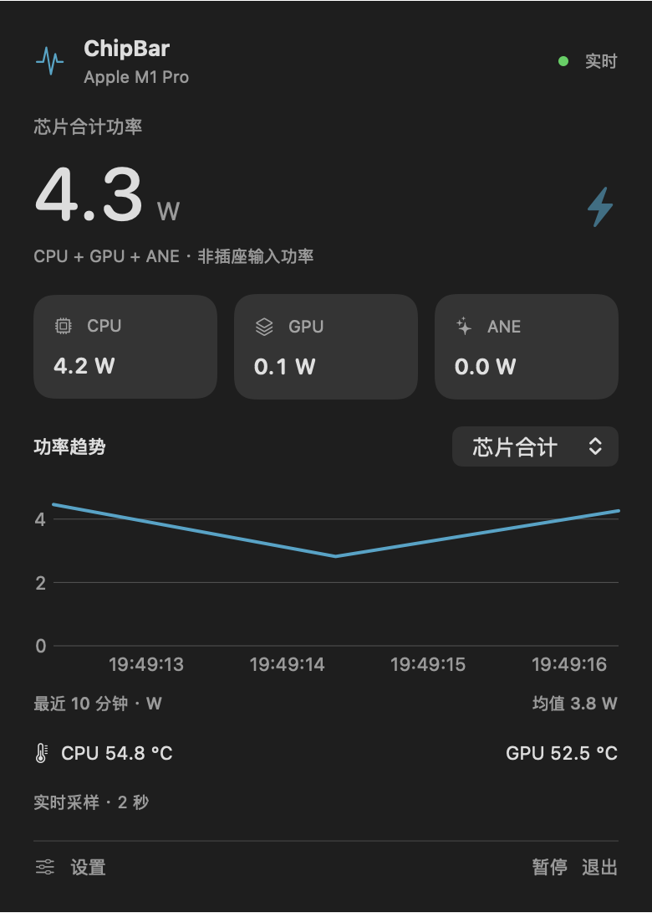
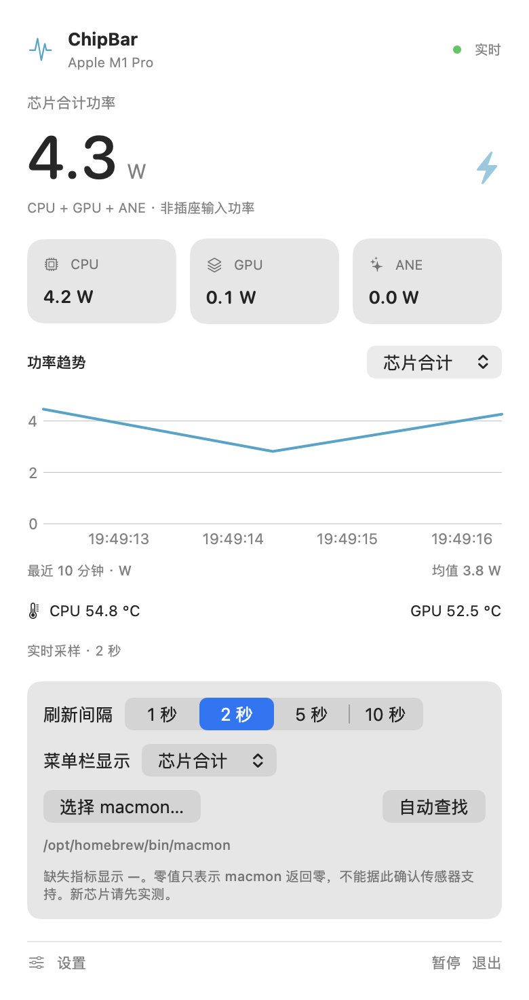

# ChipBar

原生 macOS 菜单栏功率监控，基于已经安装的 [macmon](https://github.com/vladkens/macmon)。SwiftUI + MenuBarExtra + Swift Charts；无需管理员权限。

本次实测与未验证范围见 [VALIDATION.md](VALIDATION.md)。

## 与 macmon 的关系

ChipBar 是围绕 macmon 继续开发的原生菜单栏客户端。硬件采样由 [vladkens/macmon](https://github.com/vladkens/macmon) 提供，本项目负责 macOS 界面、趋势展示、设置和采样生命周期管理。感谢 macmon 上游作者与贡献者。

当前仓库包含 Swift 客户端源码，通过 macmon 的公开 JSON 接口调用用户独立安装的程序。后续硬件采样兼容性改进适合回馈 macmon 上游，菜单栏体验改进在本项目持续开发。



<details>
<summary>浅色界面与采样设置</summary>



</details>

## 使用

1. 打开 `dist/ChipBar.app`，菜单栏出现 `⚡ 2.3 W` 形式的实时读数。
2. 点击菜单栏图标，查看 CPU / GPU / ANE、芯片合计、温度与最近十分钟趋势。
3. 点击“设置”，选择 1 / 2 / 5 / 10 秒刷新间隔，或切换菜单栏显示合计 / CPU / GPU。默认两秒。
4. 默认查找 `/opt/homebrew/bin/macmon`，其次 `/usr/local/bin/macmon`。若安装在其他位置，点击“选择 macmon…”，按 ⌘⇧G 输入所在路径，选择可执行文件。所选程序以当前用户权限运行，请选择可信的 macmon 文件。
5. “暂停”停止 macmon 进程；“继续”恢复。睡眠时停止，唤醒后自动恢复。设置保存在本机，趋势只保存在内存中，退出即清空。

两台 Mac 各运行一份应用、各使用本机 macmon。本版本不提供两台机器之间的远程汇总。

## 指标与硬件支持

- **芯片合计 = macmon 的 `all_power`，定义是 CPU + GPU + ANE。** 它不是交流电源输入功率，也不涵盖所有芯片电源域。没有 `all_power` 时，仅当三个分项均有效，才求和补出合计。
- 不展示 `sys_power`，避免把系统估算值误当作插座读数。真正的电源输入功率仍需外置功率计。
- 零瓦是 macmon 返回的有效数值；不能单凭零值判断新芯片传感器已受支持。缺失、null、负功率、异常温度和非数值字段显示“— / 不可用”。
- 动态读取 JSON 中的芯片名称与型号；没有 `soc` 字段时使用本机系统查询。没有按 M1 / M5 名称硬编码指标或功率范围。
- 实测环境：**MacBookPro18,3 / Apple M1 Pro、macOS 27.2、macmon 0.9.0**。
- **Mac mini M5 Pro 尚未实机验证。** 可运行同一 arm64 应用，实际支持取决于该机器上的 macmon 和 macOS。启动失败、指标缺失或不支持的计数器会显示原因；不承诺未知芯片传感器支持。
- 面向 Apple Silicon、macOS 13+。本次未对 macOS 13 至 26 的每个版本做实机测试。

## 构建

安装 Apple Command Line Tools 或 Xcode，建议 Swift 6 / Xcode 16 及更新版本。无外部 Swift 包，无需网络即可构建。

```sh
cd /path/to/ChipBar
./scripts/build.sh
open dist/ChipBar.app
```

构建脚本创建 arm64 `.app`，设置 `LSUIElement` 隐藏 Dock 图标，并执行本地 ad-hoc 签名与验证。它没有 Developer ID 签名或 Apple 公证。复制到另一台 Mac 后，若系统阻止运行，可通过“系统设置 → 隐私与安全性 → 仍要打开”允许自己构建且可信的应用。

源码可在 Xcode 中打开 `Package.swift`。当前测试版 SDK 的 `@State` 宏需要完整 Xcode 插件，本项目用 `ObservableObject` / `StateObject` 保存界面状态，以兼容仅安装 Command Line Tools 的环境。

## 安装与更新

```sh
./scripts/install.sh
```

安装到当前用户的 `~/Applications/ChipBar.app` 并启动，无需 sudo。脚本不覆盖已有应用；更新时先退出 ChipBar，将旧副本移走，再重新安装。也可将 `dist/ChipBar.app` 拖到“应用程序”。

开机启动可在“系统设置 → 通用 → 登录项”中添加已安装的 ChipBar。程序不会自动添加登录项。

## 验证与排查

```sh
# Swift Testing 单元测试，不依赖 XCTest
./scripts/test.sh

# 四次真实采样，与界面使用相同进程与解析代码
dist/ChipBar.app/Contents/MacOS/ChipBar --diagnose

# 自定义 macmon 路径
dist/ChipBar.app/Contents/MacOS/ChipBar --diagnose --macmon /path/to/macmon

# 受控进程故障测试，无需管理员权限
python3 scripts/integration.py

# 使用真实数据渲染原生界面 PNG，约七秒后退出
dist/ChipBar.app/Contents/MacOS/ChipBar --snapshot /absolute/path/preview.png
# 浅色模式与设置展开的预览
dist/ChipBar.app/Contents/MacOS/ChipBar --snapshot /absolute/path/settings.png --settings --light
```

最低接口要求是 `macmon pipe --interval <毫秒> --soc-info`，推荐已验证的 0.9.0。先运行 `macmon pipe --help` 和 `macmon pipe --samples 1 --soc-info` 可检查接口。老版本若不支持参数，应用会显示 macmon 的错误；可更新 macmon 后重试。

解析逐行 JSON，不解析终端仪表盘，不使用 sudo、不启动 HTTP 服务。单个持续进程在后台读取数据；行缓冲上限 1 MB、错误诊断上限 4 KB，历史最多 600 点 / 10 分钟。弹窗关闭时不绘制图表。每秒轻量检查数据是否过期，超时阈值为至少十秒或四个采样间隔。失败按 2、4、8…最多 60 秒退避重试，旧读数立即停止显示。退出会终止子进程，必要时强制清理。

“找不到 macmon”时手动选择路径。若计数器或芯片不支持，在相同机器运行上述真实采样命令，检查 macmon 本身的支持情况。

单元测试运行需要 macOS 14+ 与 Swift 6 的 Swift Testing；应用运行最低版本仍为 macOS 13。`test.sh` 会为只有 Command Line Tools 的环境补充测试框架和插件路径，并使用独立执行文件避开 File Provider 测试包签名问题。

## 源码布局

- `Sources/ChipBarCore/Metrics.swift`：可选指标解码、数值校验、逐行缓冲。
- `Sources/ChipBar/StreamClient.swift`：进程与标准输出 / 错误读取。
- `Sources/ChipBar/Monitor.swift`：状态、重试、过期检测、睡眠恢复与偏好设置。
- `Sources/ChipBar/Dashboard.swift`：弹窗、趋势与设置。
- `Sources/ChipBar/App.swift`：菜单栏入口、诊断与原生渲染工具。
- `Tests/ChipBarCoreTests`：真实 M1 Pro 夹具、缺失 / 非法值、分片与缓冲边界测试。

接口依据：[JSON pipe 实现](https://github.com/vladkens/macmon/blob/main/src/app/main.rs)、[指标定义](https://github.com/vladkens/macmon/blob/main/src/metrics.rs)，核对日期 2026-10-08；同时以本机 0.9.0 实际输出验证。上游链接可能随版本变化。本项目调用独立安装的 macmon，不包含或修改其可执行文件。
